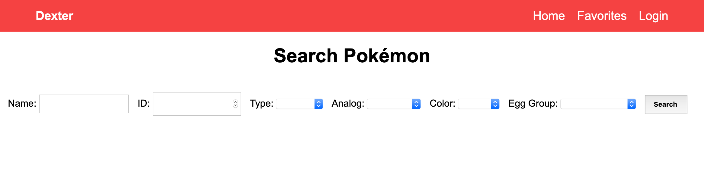
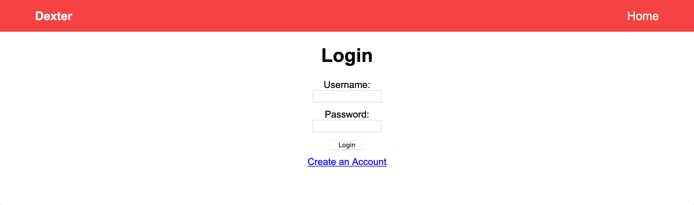
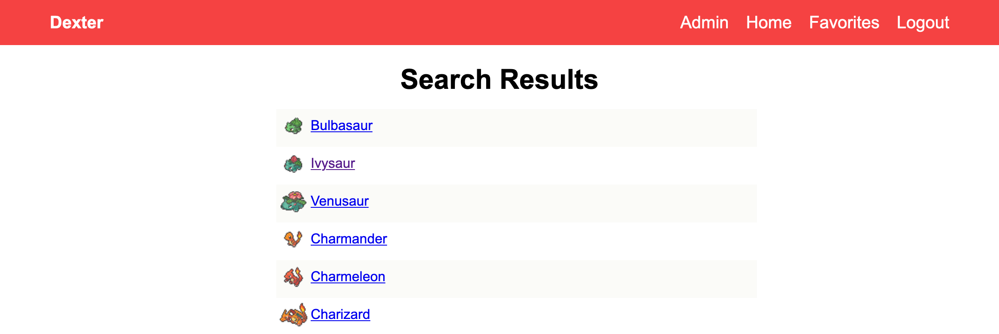
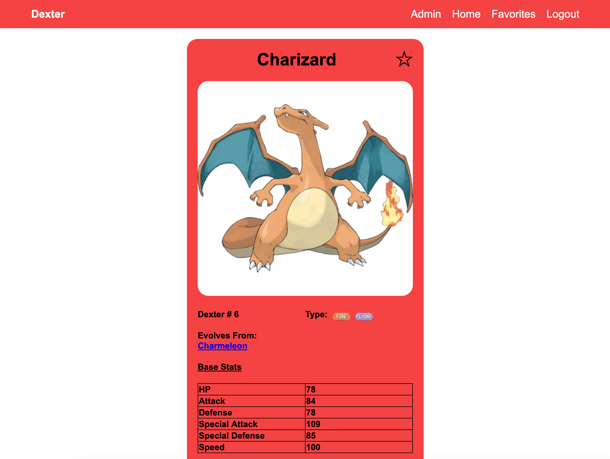

# Dexter

This project is intended to provide a light-weight Pokemon lookup and favoriting interface to casual Pokémon fans.

The project utilizes the Model View Controller architecture and relies on routing all incoming requests through a Front Controller. URIs are to fit the `<host>/Dexter/<controller>/<action>/<param1>/<param2./<...>/<paramN>/` template. The technologies used are PHP7, CSS3, HTML, and MySQL 

# Installation

First, clone the repository into the root directory of an Apache HTTP Server. To setup the initial state of the database, run the command, navigate to the directory `DatabaseState` and concatenate the fragmented MySQL dump file.
```bash
$ cat xaa xab xac > dbStartState.sql
```
Next, create a new MySQL database called `Pokedex_DB`, then restore the new database from the dump file.
```bash
$ mysql -u <username> -p <password> Pokedex_DB < dbStartState.sql
```
Finally, open the MySQL CLI client and create read-only and writable users for the application.
```sql
mysql> CREATE USER 'dex_user_ro'@'localhost' IDENTIFIED BY 'ro_password';
mysql> GRANT SELECT ON Pokedex_DB.* To 'dex_user_ro'@'localhost';

mysql> CREATE USER 'dex_user_w'@'localhost' IDENTIFIED BY 'w_password';
mysql> GRANT SELECT, UPDATE, INSERT, DELETE ON Pokedex_DB.* TO 'dex_user_ro'@'localhost';
```

# Usage

With the Apache HTTP Server and MySQL running, you should now be able to open the URL http://localhost/Dexter/home and see the home page of the site. 


Once there, navigate to the login page to either create an account, or log in to the provided admin account; username: "dexAdmin", password: "profOak".


Once back at the home page, make a search and view the results.


Select a Pokémon to view its profile page where you can learn more about it and, if you like, favorite it so that you can easily access it later.



# Acknowledgment

Pokedex.json, the sprites, and Pokémon images were sourced from [fanzeyi](https://github.com/fanzeyi)'s [repository](https://github.com/fanzeyi/pokemon.json) and consist of materials copyrighted by the Pokémon Corporation and collected by the editors of [Bulbapedia](https://bulbapedia.bulbagarden.net/wiki/Main_Page). 
The Front Controller design was largely inspired by [Alejandro Gervasio](https://www.sitepoint.com/author/agervasio/)'s [article](https://www.sitepoint.com/front-controller-pattern-1/) on the subject.
